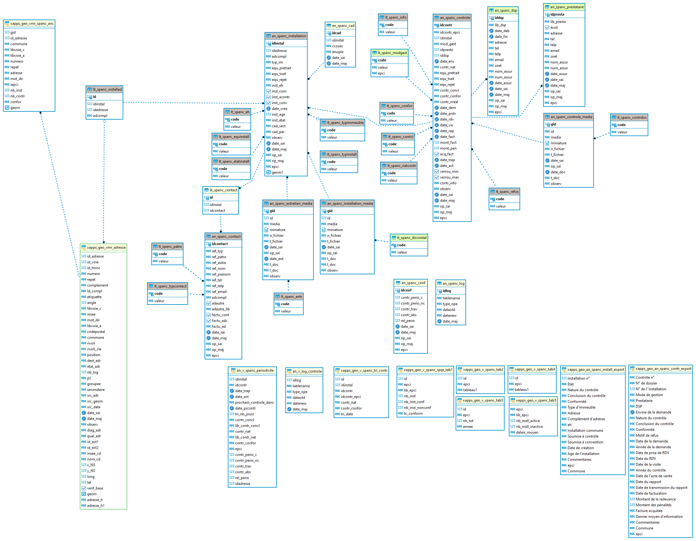

# Documentation d'administration de la base de données du SPANC (Service Public d'Assainissement Non Collectif #

## Principes
  * **généralité** :

En 2022, un nouveau cadre de mutualisation s'est ouvert avec l'accueil d'une nouvelle EPCI formant ainsi le territoire du Grand Compiégnois comprenant désormais 4 EPCI. Celui-ci a fait émerger l'envie de disposer d'une application sur les contrôles de l'assainissement non collecif qui est une préoccupation partagée.

Cette application repose sur le développement d'une base de données partagée, stockée dans l'entrepôt de données du GéoCompiégnois, et à la fois étanche entre chaque EPCI.

L'application ainsi développée permet à chaque EPCI de disposer de ses propres données et de bénéficier des apports fonctionnels de tous.
 
 * **résumé fonctionnel** :

Pour rappel des grands principes :

* le modèle de données et l'application répondent à un besoin de gestion administrative des dossiers ANC. Ils ne permettent pas la saisie d'un contrôle complet dans le cadre du SPANC de chaque EPCI.
* la localisation des installations s'appuie sur le référentiel Base Adresse Locale
* un contrôle est rattachée à une installation et une seule
* une adresse peut disposer de n installations
* une installation peut-être partagée par plusieurs adresses
* l'application permet d'associer des documents, des contacts, ...
* des statistiques pour le SPANC sont disponibles
* la gestion des automatismes de rappel ou d'alertes sont gérées pour chaque EPCI (paramétrage possible pour chacun)

## Schéma fonctionnel

(en refonte)

## Modèle relationel simplifié

## Dépendances

Cette base de donnnées est dépendante de la Base Adresse Locale.

`[x_apps].[x_apps_geo_vmr_adresse]` : table géographique partagé des adresses

## Classes d'objets partagé et primitive graphique

`[m_spanc].[xapps_geo_vmr_spanc_anc]` : vue matérialisée géographique partagé avec la Base Adresse Locale permettant l'affichage et le fonctionnel au clic dans l'application. Cette vue remonte pour chaque adresse le nombre d'installation active, de contrôles et la conformité du dernier contrôle.

|Nom attribut | Définition | Type | Valeurs par défaut |
|:---|:---|:---|:---|
|gid|Identifiant unique de l'objet point adresse|bigint| |
|id_adresse|Identifiant unique interne de l'adresse|bigint| |
|commune|Libellé de la commune|varchar(80)|issue de la BAL|
|libvoie_c|Libellé de la voie|varchar(100)|issu de la BAL|
|libvoie_a|Libellé de la commune (norme AFNOR)|varchar(100)|issu de la BAL|
|numero|Numéro de voirie|varchar(10)|issu de la BAL|
|repet|indice de répétition dans la voie|varchar(10)|issu de la BAL |
|adresse|reconstruction de l'adresse complète|varchar(10)|issue de la BAL |
|iepci|acronyme de l'EPCI|text|arc, cclo, ccpe, cc2v (issue de la table `r_administratif.an_geo`) |
|nb_inst|nombre d'installation active à l'adresse (associée ou non)|numeric||
|nb_contr|nombre de contrôles réalisés à l'adresse avec un niveau de conformité attribué|numeric||
|confor|dernier niveau de conformité attribué (si 1 installation = conformité du dernier contrôle, si n installations conformité la moins favorable du dernier contrôle de chaque installation)|varchar||
|geom|géométrie du point d'adresse|geom(point,2154)|issu de la BAL|

Particularité(s) à noter :
* L'attribut `gid` sert de référence unique 
* Cette vue matérialisée est rafraichie automatiquement à chaque insertion, mise à jour ou suppression d'une installation, d'un contrôle ou d'une association d'adresses. 

## Classes d'objets du SPANC

L'ensemble des classes d'objets de gestion sont stockés dans le schéma `m_spanc`.

### Classes d'objets attributaire :

`[m_spanc].[an_spanc_installation]` : table alphanumérique contenant les attributs métiers de l'installation
   
|Nom attribut | Définition | Type | Valeurs par défaut |
|:---|:---|:---|:---|
|idinstal|Identifiant interne non signifiant|bigint|nextval('an_spanc_installation_id_seq'::regclass)|
|idadresse|Identifiant de base adresse locale du Grand Compiégnois|bigint| |
|adcompl|Complément d'adresse|text| |
|typ_im|Type d'immeuble concerné|character varying(2)| |
|equ_pretrait|Equipement de pré-traitement|text|'00'::character varying|
|equ_trait|Equipement de traitement|text|'00'::character varying|
|equ_rejet|Equipement de rejet|text|'00'::character varying|
|inst_eh|Equivalent habitant de l'installation|character varying(2)|'00'::character varying|
|inst_com|Installation commune à plusieurs immeubles|boolean|false|
|inst_acontr|Installation soumis à un contrôle|boolean|true|
|inst_conv|Installation soumis à une convention|boolean|false|
|date_crea|Date de création de l'installation|timestamp without time zone| |
|inst_age|Age de l'installation sans connaître la date de création|integer| |
|inst_etat|Etat de l'installation|character varying(2)|'10'::character varying|
|cad_sect|Section cadastrale|character varying(2)| |
|cad_par|Parcelle cadastrale|character varying(4)| |
|observ|Commentaires divers|character varying(5000)| |
|date_sai|Date de saisie des informations d'installation|timestamp without time zone| |
|date_maj|Date de mise à jour des informations d'installation|timestamp without time zone| |
|op_sai|Opérateur ayant saisi l'information d'installation|character varying(20)| |
|op_maj|Opérateur ayant modifier les informations d'installation|character varying(20)| |
|epci|Acronyme de l'EPCI d'assise de l'installation|text| |
|geom1|Géométrie du point d'adresse (uniquement pour les associations d'adresse d'installations communes)|USER-DEFINED| |

Particularité(s) à noter :
* Une clé primaire existe sur le champ `idinstal` l'attribution automatique de la référence unique s'effectue via une séquence. 
* Une clé étrangère existe sur la table de valeur `an_spanc_installation_eh_fkey` (lien vers la liste de valeurs du type d'installation `lt_spanc_eh`)
* Une clé étrangère existe sur la table de valeur `an_spanc_installation_inst_etat_fkey` (lien vers la liste de valeurs de l'état de l'installation `lt_spanc_etatinstall`)
* Une clé étrangère existe sur la table de valeur `an_spanc_installation_typim_fkey` (lien vers la liste de valeurs du type d'immeuble `lt_spanc_typim`)

* 1 triggers :
  * `t_t1_100` : trigger permettant d'insérer toutes les modifications dans la table des logs
  * `t_t1_an_spanc_installation_date_sai` : trigger permettant d'insérer la date de saisie
  * `t_t2_an_spanc_installation_date_maj` : trigger permettant d'insérer la date de mise à jour
  * `t_t3_an_spanc_installation_controle_saisie` : trigger permettant de gérer les contrôles de saisie et les insertions de certains attributs particulier à l'insertion
  *  `t_t8_refresh_carto` : trigger permettant de rafraichir la vue matérialisée `m_spanc.xapps_geo_vmr_spanc_anc`
  *  `t_t9_autorite_competente` : trigger permettant de récupérer l'EPCI d'appartenance de l'utilisateur pour insertion dans les données afin de gérer les droits et l'étanchéïté des données 
 
---

`[m_spanc].[an_spanc_controle]` : table alphanumérique contenant les attributs métiers de chaque contrôle d'une installation
   
|Nom attribut | Définition | Type | Valeurs par défaut |
|:---|:---|:---|:---|
|idcontr|Identifiant interne non signifiant|text| |
|idcontr_epci|Identifiant propre à l'EPCI|text| |
|idinstal|Identifiant de l'installation|bigint| |
|mod_gest|Mode de gestion du contrôle|character varying(2)| |
|idpresta|Identifiant du prestataire ayant réalisé le contrôle|integer| |
|iddsp|Identifiant de la DSP ayant réalisé le contrôle|integer| |
|contr_nat|Origine de déclenchement du contrôle|character varying(2)|'00'::character varying|
|equ_pretrait|Equipement de pré-traitement|text|'00'::character varying|
|equ_trait|Equipement de traitement|text|'00'::character varying|
|equ_rejet|Equipement de rejet|text|'00'::character varying|
|contr_concl|Conclusion du contrôle|character varying(2)|'00'::character varying|
|contr_confor|Conformité du contrôle|character varying(2)|'00'::character varying|
|contr_nreal|Motif de la non réalisation du contrôle|character varying(2)|'00'::character varying|
|date_dem|Date de la demande du contrôle|timestamp without time zone| |
|date_prdv|Date de prise de rendez-vous|timestamp without time zone| |
|date_rdv|Date du rendez-vous|timestamp without time zone| |
|date_vis|Date de la visite|timestamp without time zone| |
|date_rap|Date du rapport|timestamp without time zone| |
|date_fact|Date de facturation|timestamp without time zone| |
|mont_fact|Montant facturé de la redevance|double precision| |
|mont_pen|Montant des pénalités|double precision| |
|acq_fact|Facture réglée|boolean|false|
|date_trap|Date de transmission du rapport|timestamp without time zone| |
|date_act|Date d'acte de vente|timestamp without time zone| |
|verrou_min|Verrou minimum sur les données, si date de transmission, peut encore modifier la facturation|boolean|false|
|verrou_max|Verrou maximum sur les données, si facture acquitée, avec date de facturation et date de transmission bloque les modifications|boolean|false|
|contr_info|Dernier moyen d'informations ou de communication utilisé|character varying(2)|'00'::character varying|
|observ|Commentaires divers|character varying(5000)| |
|date_sai|Date de saisie des informations d'installation|timestamp without time zone| |
|date_maj|Date de mise à jour des informations d'installation|timestamp without time zone| |
|op_sai|Opérateur ayant saisi l'information d'installation|character varying(20)| |
|op_maj|Opérateur ayant modifier les informations d'installation|character varying(20)| |
|epci|Acronyme de l'EPCI d'assise de l'installation|text| |

Particularité(s) à noter :
* Une clé primaire existe sur le champ `idcontr` l'attribution automatique de la référence unique s'effectue via une séquence. 
* Une clé étrangère existe sur la table de valeur `an_spanc_controle_contrconcl_fkey` (lien vers la liste de valeurs des conclusions du contrôle `lt_spanc_contcl`)
* Une clé étrangère existe sur la table de valeur `an_spanc_controle_contrconfor_fkey` (lien vers la liste de valeurs des conformités `lt_spanc_confor`)
* Une clé étrangère existe sur la table de valeur `an_spanc_controle_contrinfo_fkey` (lien vers la liste de valeurs du dernier moyen de communication utilisée `lt_spanc_info`)
* Une clé étrangère existe sur la table de valeur `an_spanc_controle_contrnat_fkey` (lien vers la liste de valeurs sur la nature du contrôle `lt_spanc_natcontr`)
* Une clé étrangère existe sur la table de valeur `an_spanc_controle_contrnreal_fkey` (lien vers la liste de valeurs sur les types de refus d'un contrôle `lt_spanc_refus`)
* Une clé étrangère existe sur la table de valeur `an_spanc_controle_modgest_fkey` (lien vers la liste de valeurs sur le mode de gestion du contrôle `lt_spanc_modgest`)

* 1 triggers :
  * `t_t0_an_spanc_controle_idcontr` : trigger permettant de formater l'identifiant du contrôle (EPCI + num)
  * `t_t1_100` : trigger permettant d'insérer toutes les modifications dans la table des logs
  * `t_t1_an_spanc_controle_date_sai` : trigger permettant d'insérer la date de saisie
  * `t_t2_an_spanc_controle_date_maj` : trigger permettant d'insérer la date de mise à jour
  * `t_t4_an_spanc_controle_conform` : trigger permettant de gérer les contrôles de saisie, les insertions de certains attributs particulier et de déterminer automatiquement la conformité
  * `t_t5_an_spanc_controle_equi_update` : trigger permettant de gérer la mise à jour des équipements au niveau de l'installation à la mise à jour
  * `t_t6_an_spanc_controle_equi_insert` : trigger permettant de gérer la mise à jour des équipements au niveau de l'installation à l'insertion
  * `t_t8_refresh_carto` : trigger permettant de rafraichir la vue matérialisée `m_spanc.xapps_geo_vmr_spanc_anc`
  *  `t_t9_autorite_competente` : trigger permettant de récupérer l'EPCI d'appartenance de l'utilisateur pour insertion dans les données afin de gérer les droits et l'étanchéïté des données 
 
---

`[m_spanc].[an_spanc_cad]` : table alphanumérique contenant les références cadastrales associées aux installations
   
|Nom attribut | Définition | Type | Valeurs par défaut |
|:---|:---|:---|:---|
|idcad|Identifiant interne non signifiant pour chaque enregistrement|bigint|nextval('an_spanc_cad_seq'::regclass)|
|idinstal|Identifiant interne non signifiant de l'installation|bigint| |
|ccosec|Section cadastrale|character varying(2)| |
|dnupla|Parcelle cadastrale|character varying(4)| |
|date_sai|Date de saisie des informations d'installation|timestamp without time zone| |
|date_maj|Date de mise à jour des informations d'installation|timestamp without time zone| |

Particularité(s) à noter :
* Une clé primaire existe sur le champ `idinstal` l'attribution automatique de la référence unique s'effectue via une séquence. 

* 1 triggers :
  * `t_t1_100` : trigger permettant d'insérer toutes les modifications dans la table des logs
  * `t_t1_an_spanc_cad_date_sai` : trigger permettant d'insérer la date de saisie
  * `t_t2_an_spanc_cad_date_maj` : trigger permettant d'insérer la date de mise à jour
  * `t_t3_an_spanc_cad_date_maj` : trigger permettant de gérer les contrôles de saisie 
---

#### Liste de valeurs

`[m_spanc].[]` : Liste des valeurs permettant de décrire 

|Nom attribut | Définition | Type  | Valeurs par défaut |
|:---|:---|:---|:---|    

Particularité(s) à noter :
* Une clé primaire existe sur le champ code 

Valeurs possibles :

|Code|Valeur|
|:---|:---|

---

### Classes d'objets attributaire gérant les associations (ou relation d'appartenance des objets entre eux) :

`[m_spanc].[]` : table alphanumérique de relation entre 
   
|Nom attribut | Définition | Type | Valeurs par défaut |
|:---|:---|:---|:---|

Particularité(s) à noter :
* Une clé primaire existe sur le champ `` l'attribution automatique de la référence unique s'effectue via une séquence. 

* 4 triggers :
  * `` : trigger permettant de 

  
---

### classes d'objets applicatives métiers :

  * `` : Vue alphanumérique permettant de calculer des 

### classes d'objets applicatives grands publics sont classés dans le schéma x_apps_public :

Sans objet

### classes d'objets opendata sont classés dans le schéma x_opendata :

Sans objet

## Projet QGIS pour la gestion

Sans objet

## Traitement automatisé mis en place (Workflow de l'ETL FME)

Sans objet

## Export Open Data

Sans objet

---
