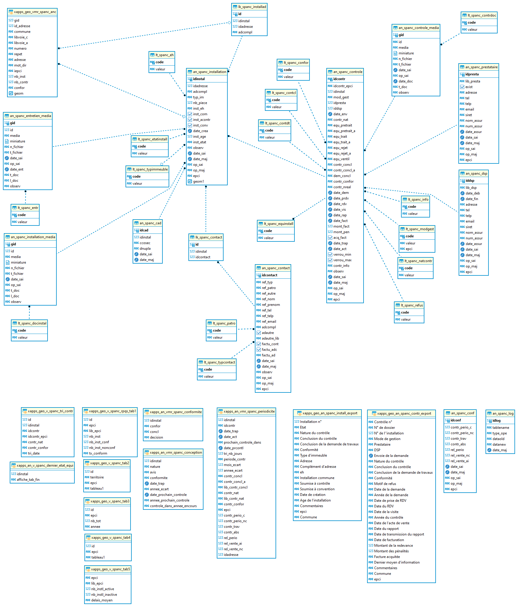

# Documentation d'administration de la base de données du SPANC (Service Public d'Assainissement Non Collectif) #

## Principes
  * **généralité** :

En 2022, un nouveau cadre de mutualisation s'est ouvert avec l'accueil d'une nouvelle EPCI formant ainsi le territoire du Grand Compiégnois comprenant désormais 4 EPCI. Celui-ci a fait émerger l'envie de disposer d'une application sur les contrôles de l'assainissement non collecif qui est une préoccupation partagée.

Cette application repose sur le développement d'une base de données partagée, stockée dans l'entrepôt de données du GéoCompiégnois, et à la fois étanche entre chaque EPCI.

L'application ainsi développée permet à chaque EPCI de disposer de ses propres données et de bénéficier des apports fonctionnels de tous.
 
 * **résumé fonctionnel** :

Pour rappel des grands principes :

* le modèle de données et l'application répondent à un besoin de gestion administrative des dossiers ANC. Ils ne permettent pas la saisie d'un contrôle complet dans le cadre du SPANC de chaque EPCI.
* la localisation des installations s'appuie sur le référentiel Base Adresse Locale
* un contrôle est rattachée à une installation et une seule
* une adresse peut disposer de n installations
* une installation peut-être partagée par plusieurs adresses
* l'application permet d'associer des documents, des contacts, ...
* des statistiques pour le SPANC sont disponibles
* la gestion des automatismes de rappel ou d'alertes sont gérées pour chaque EPCI (paramétrage possible pour chacun)

## Schéma fonctionnel

## Modèle relationel simplifié

## Dépendances

Cette base de donnnées est dépendante de la Base Adresse Locale.

`[x_apps].[x_apps_geo_vmr_adresse]` : table géographique partagé des adresses

## Classes d'objets partagé et primitive graphique

`[m_spanc].[xapps_geo_vmr_spanc_anc]` : vue matérialisée géographique partagé avec la Base Adresse Locale permettant l'affichage et le fonctionnel au clic dans l'application. Cette vue remonte pour chaque adresse le nombre d'installation active, de contrôles et la conformité du dernier contrôle.

|Nom attribut | Définition | Type | Valeurs par défaut |
|:---|:---|:---|:---|
|gid|Identifiant unique de l'objet point adresse|bigint| |
|id_adresse|Identifiant unique interne de l'adresse|bigint| |
|commune|Libellé de la commune|varchar(80)|issue de la BAL|
|libvoie_c|Libellé de la voie|varchar(100)|issu de la BAL|
|libvoie_a|Libellé de la commune (norme AFNOR)|varchar(100)|issu de la BAL|
|numero|Numéro de voirie|varchar(10)|issu de la BAL|
|repet|indice de répétition dans la voie|varchar(10)|issu de la BAL |
|adresse|reconstruction de l'adresse complète|varchar(10)|issue de la BAL |
|iepci|acronyme de l'EPCI|text|arc, cclo, ccpe, cc2v (issue de la table `r_administratif.an_geo`) |
|nb_inst|nombre d'installation active à l'adresse (associée ou non)|numeric||
|nb_contr|nombre de contrôles réalisés à l'adresse avec un niveau de conformité attribué|numeric||
|confor|dernier niveau de conformité attribué (si 1 installation = conformité du dernier contrôle, si n installations conformité la moins favorable du dernier contrôle de chaque installation)|varchar||
|geom|géométrie du point d'adresse|geom(point,2154)|issu de la BAL|

Particularité(s) à noter :
* L'attribut `gid` sert de référence unique 
* Cette vue matérialisée est rafraichie automatiquement à chaque insertion, mise à jour ou suppression d'une installation, d'un contrôle ou d'une association d'adresses. 

## Classes d'objets du SPANC

L'ensemble des classes d'objets de gestion sont stockés dans le schéma `m_spanc`.

### Classes d'objets attributaire :

`[m_spanc].[an_spanc_installation]` : table alphanumérique contenant les attributs métiers de l'installation
   
|Nom attribut | Définition | Type | Valeurs par défaut |
|:---|:---|:---|:---|
|idinstal|Identifiant interne non signifiant|bigint|nextval('m_spanc.an_spanc_installation_id_seq'::regclass)|
|idadresse|Identifiant de base adresse locale du Grand Compiégnois|bigint| |
|adcompl|Complément d'adresse|text| |
|typ_im|Type d'immeuble concerné|character varying(2)| |
|nb_piece|Nombre de pièces principales|integer| |
|inst_eh|Equivalent habitant de l'installation|character varying(2)|'00'::character varying|
|inst_com|Installation commune à plusieurs immeubles|boolean|false|
|inst_acontr|Installation soumis à un contrôle|boolean|true|
|inst_conv|Installation soumis à une convention|boolean|false|
|date_crea|Date de création de l'installation|timestamp without time zone| |
|inst_age|Age de l'installation sans connaître la date de création|integer| |
|inst_etat|Etat de l'installation|character varying(2)|'10'::character varying|
|cad_sect|Section cadastrale|character varying(2)| |
|cad_par|Parcelle cadastrale|character varying(4)| |
|observ|Commentaires divers|character varying(5000)| |
|date_sai|Date de saisie des informations d'installation|timestamp without time zone| |
|date_maj|Date de mise à jour des informations d'installation|timestamp without time zone| |
|op_sai|Opérateur ayant saisi l'information d'installation|character varying(20)| |
|op_maj|Opérateur ayant modifier les informations d'installation|character varying(20)| |
|epci|Acronyme de l'EPCI d'assise de l'installation|text| |
|geom1|Géométrie du point d'adresse récupéré à la saisie pour la fonctionnalité d'association d'adresse à une installation pour la sélection via l'objet courant dans GEO et affichage des adresses dans un rayon de 50m|Geometry(point,2154)| |

Particularité(s) à noter :
* Une clé primaire existe sur le champ `idinstal` l'attribution automatique de la référence unique s'effectue via une séquence. 
* Une clé étrangère existe sur la table de valeur `an_spanc_installation_eh_fkey` (lien vers la liste de valeurs du type d'installation `lt_spanc_eh`)
* Une clé étrangère existe sur la table de valeur `an_spanc_installation_inst_etat_fkey` (lien vers la liste de valeurs de l'état de l'installation `lt_spanc_etatinstall`)
* Une clé étrangère existe sur la table de valeur `an_spanc_installation_typim_fkey` (lien vers la liste de valeurs du type d'immeuble `lt_spanc_typim`)

* 6 triggers :
  * `t_t1_100` : trigger permettant d'insérer toutes les modifications dans la table des logs
  * `t_t1_an_spanc_installation_date_sai` : trigger permettant d'insérer la date de saisie
  * `t_t2_an_spanc_installation_date_maj` : trigger permettant d'insérer la date de mise à jour
  * `t_t3_an_spanc_installation_controle_saisie` : trigger permettant de gérer les contrôles de saisie et les insertions de certains attributs particulier à l'insertion
  *  `t_t8_refresh_carto` : trigger permettant de rafraichir la vue matérialisée `m_spanc.xapps_geo_vmr_spanc_anc`
  *  `t_t9_autorite_competente` : trigger permettant de récupérer l'EPCI d'appartenance de l'utilisateur pour insertion dans les données afin de gérer les droits et l'étanchéïté des données 
 
---

`[m_spanc].[an_spanc_controle]` : table alphanumérique contenant les attributs métiers de chaque contrôle d'une installation
   
|Nom attribut | Définition | Type | Valeurs par défaut |
|:---|:---|:---|:---|
|idcontr|Identifiant interne non signifiant|text| |
|idcontr_epci|Identifiant propre à l'EPCI|text| |
|idinstal|Identifiant de l'installation|bigint| |
|mod_gest|Mode de gestion du contrôle|character varying(2)| |
|idpresta|Identifiant du prestataire ayant réalisé le contrôle|integer| |
|iddsp|Identifiant de la DSP ayant réalisé le contrôle|integer| |
|date_env|Date d'envoi de la demande|timestamp without time zone| |
|contr_nat|Origine de déclenchement du contrôle|character varying(2)|'00'::character varying|
|equ_pretrait|Equipement de pré-traitement|text|'00'::character varying|
|equ_pretrait_a|Autre équipement de pré-traitement|text| |
|equ_trait|Equipement de traitement|text|'00'::character varying|
|equ_trait_a|Autre équipement de traitement|text| |
|equ_rejet|Equipement de rejet|text|'00'::character varying|
|equ_rejet_a|Autre équipement de rejet|text| |
|equ_ventil|Présence ou non d'une ventilation secondaire|character varying(1)| |
|contr_concl|Conclusion du contrôle|character varying(2)|'00'::character varying|
|contr_concl_a|Conclusion des anciens contrôles (P1,P2 P3)|character varying(2)|'00'::character varying|
|dem_concl|Conclusion de l'analyse du dossier de demande de travaux neuf ou réhabilitation|character varying(2)||
|contr_confor|Conformité du contrôle|character varying(2)|'00'::character varying|
|contr_nreal|Motif de la non réalisation du contrôle|character varying(2)|'00'::character varying|
|date_dem|Date de la demande du contrôle|timestamp without time zone| |
|date_prdv|Date de prise de rendez-vous|timestamp without time zone| |
|date_rdv|Date du rendez-vous|timestamp without time zone| |
|date_vis|Date de la visite|timestamp without time zone| |
|date_rap|Date du rapport|timestamp without time zone| |
|date_fact|Date de facturation|timestamp without time zone| |
|mont_fact|Montant facturé de la redevance|double precision| |
|mont_pen|Montant des pénalités|double precision| |
|acq_fact|Facture réglée|boolean|false|
|date_trap|Date de transmission du rapport|timestamp without time zone| |
|date_act|Date d'acte de vente|timestamp without time zone| |
|verrou_min|Verrou minimum sur les données, si date de transmission, peut encore modifier la facturation|boolean|false|
|verrou_max|Verrou maximum sur les données, si facture acquitée, avec date de facturation et date de transmission bloque les modifications|boolean|false|
|contr_info|Dernier moyen d'informations ou de communication utilisé|character varying(2)|'00'::character varying|
|observ|Commentaires divers|character varying(5000)| |
|date_sai|Date de saisie des informations d'installation|timestamp without time zone| |
|date_maj|Date de mise à jour des informations d'installation|timestamp without time zone| |
|op_sai|Opérateur ayant saisi l'information d'installation|character varying(20)| |
|op_maj|Opérateur ayant modifier les informations d'installation|character varying(20)| |
|epci|Acronyme de l'EPCI d'assise de l'installation|text| |

Particularité(s) à noter :
* Une clé primaire existe sur le champ `idcontr` l'attribution automatique de la référence unique s'effectue via une séquence. 
* Une clé étrangère existe sur la table de valeur `an_spanc_controle_contrconcl_fkey` (lien vers la liste de valeurs des conclusions du contrôle `lt_spanc_contcl`)
* Une clé étrangère existe sur la table de valeur `an_spanc_controle_contrconfor_fkey` (lien vers la liste de valeurs des conformités `lt_spanc_confor`)
* Une clé étrangère existe sur la table de valeur `an_spanc_controle_contrinfo_fkey` (lien vers la liste de valeurs du dernier moyen de communication utilisée `lt_spanc_info`)
* Une clé étrangère existe sur la table de valeur `an_spanc_controle_contrnat_fkey` (lien vers la liste de valeurs sur la nature du contrôle `lt_spanc_natcontr`)
* Une clé étrangère existe sur la table de valeur `an_spanc_controle_contrnreal_fkey` (lien vers la liste de valeurs sur les types de refus d'un contrôle `lt_spanc_refus`)
* Une clé étrangère existe sur la table de valeur `an_spanc_controle_demc_concl_fkey` (lien vers la liste de valeurs sur les conclusions des demandes de travaux `lt_spanc_contdt`)
* Une clé étrangère existe sur la table de valeur `an_spanc_controle_modgest_fkey` (lien vers la liste de valeurs sur le mode de gestion du contrôle `lt_spanc_modgest`)
  

* 7 triggers :
  * `t_t0_an_spanc_controle_idcontr` : trigger permettant de formater l'identifiant du contrôle (EPCI + num)
  * `t_t1_100` : trigger permettant d'insérer toutes les modifications dans la table des logs
  * `t_t1_an_spanc_controle_date_sai` : trigger permettant d'insérer la date de saisie
  * `t_t2_an_spanc_controle_date_maj` : trigger permettant d'insérer la date de mise à jour
  * `t_t4_an_spanc_controle_conform` : trigger permettant de gérer les contrôles de saisie, les insertions de certains attributs particulier et de déterminer automatiquement la conformité
  * `t_t8_refresh_carto` : trigger permettant de rafraichir la vue matérialisée `m_spanc.xapps_geo_vmr_spanc_anc`
  * `t_t9_autorite_competente` : trigger permettant de récupérer l'EPCI d'appartenance de l'utilisateur pour insertion dans les données afin de gérer les droits et l'étanchéïté des données 
 
---

`[m_spanc].[an_spanc_cad]` : table alphanumérique contenant les références cadastrales associées aux installations
   
|Nom attribut | Définition | Type | Valeurs par défaut |
|:---|:---|:---|:---|
|idcad|Identifiant interne non signifiant pour chaque enregistrement|bigint|nextval('an_spanc_cad_seq'::regclass)|
|idinstal|Identifiant interne non signifiant de l'installation|bigint| |
|ccosec|Section cadastrale|character varying(2)| |
|dnupla|Parcelle cadastrale|character varying(4)| |
|date_sai|Date de saisie des informations d'installation|timestamp without time zone| |
|date_maj|Date de mise à jour des informations d'installation|timestamp without time zone| |

Particularité(s) à noter :
* Une clé primaire existe sur le champ `idinstal` l'attribution automatique de la référence unique s'effectue via une séquence. 

* 4 triggers :
  * `t_t1_100` : trigger permettant d'insérer toutes les modifications dans la table des logs
  * `t_t1_an_spanc_cad_date_sai` : trigger permettant d'insérer la date de saisie
  * `t_t2_an_spanc_cad_date_maj` : trigger permettant d'insérer la date de mise à jour
  * `t_t3_an_spanc_cad_controle` : trigger permettant de gérer les contrôles de saisie 
  
---

`[m_spanc].[an_spanc_conf]` : table alphanumérique contenant les paramètres des périodes à appliquer entre chaque contrôle
   
|Nom attribut | Définition | Type | Valeurs par défaut |
|:---|:---|:---|:---|
|idconf|Identifiant interne non signifiant pour chaque enregistrement|bigint|nextval('an_spanc_conf_seq'::regclass)|
|contr_perio_c|Nombre d'années entre 2 contrôles périodiques des installations conformes|smallint| |
|contr_perio_nc|Nombre d'années entre 2 contrôles périodiques des installations non conformes|smallint| |
|contr_trav|Nombre d'années de délais pour la réalisation des travaux|smallint| |
|contr_abs|Nombre de mois pour la vérification si absence d'installation|smallint| |
|rel_perio|Délais de relance lié à un contrôle en mois si la date choisie pour l'automatisme n'est pas remplie|smallint| |
|rel_vente_nc|Délais de relance lié à un contrôle de vente avec une non conformité (grave ou pas)|smallint| |
|rel_vente_ai|Délais de relance lié à un contrôle de vente avec une absence d'installation|smallint| |
|date_sai|Date de saisie des informations d'installation|timestamp without time zone| |
|date_maj|Date de mise à jour des informations d'installation|timestamp without time zone| |
|op_sai|Opérateur ayant saisi l'information d'installation|character varying(20)| |
|op_maj|Opérateur ayant modifier les informations d'installation|character varying(20)| |
|epci|Acronyme de l'EPCI d'assise de l'installation|text| |

Particularité(s) à noter :
* Une clé primaire existe sur le champ `idconf` l'attribution automatique de la référence unique s'effectue via une séquence. 

* 5 triggers :
  * `t_t1_100` : trigger permettant d'insérer toutes les modifications dans la table des logs
  * `t_t1_an_spanc_conf_date_sai` : trigger permettant d'insérer la date de saisie
  * `t_t2_an_spanc_conf_date_maj` : trigger permettant d'insérer la date de mise à jour
  * `t_t3_an_spanc_controle_conf` : trigger permettant de gérer les contrôles de saisie 
  * `t_t9_autorite_competente` : trigger permettant de récupérer l'EPCI d'appartenance de l'utilisateur pour insertion dans les données afin de gérer les droits et l'étanchéïté des données 
 
---

`[m_spanc].[an_spanc_contact]` : table alphanumérique contenant les contacts
   
|Nom attribut | Définition | Type | Valeurs par défaut |
|:---|:---|:---|:---|
|idcontact|Identifiant interne non signifiant|bigint|nextval('an_spanc_contact_id_seq'::regclass)|
|ref_typ|Typologie de la référence pour le contrôle|character varying(2)|'00'::character varying|
|ref_patro|Patronyme du référent|character varying(2)|'00'::character varying|
|ref_autre|Libellé de l'organisme référente pour le contrôle (si type de référent est autre)|text| |
|ref_nom|Nom de la personne physique référente pour le contrôle|text| |
|ref_prenom|Prénom de la personne physique référente pour le contrôle|text| |
|ref_tel|Téléphone du référent pour le contrôle|character varying(10)| |
|ref_telp|Téléphone portable du référent pour le contrôle|character varying(10)| |
|ref_email|Email du référent pour le contrôle|text| |
|adcompl|Complément d'adresse|text| |
|adautre|Adresse différente du lieu|boolean|false|
|adautre_lib|Libellé de l'Adresse différente du lieu|text| |
|factu_cont|Contact pour la facturation|boolean|false|
|factu_adc|Adresse de facturation différente de l'adresse de l'installation|boolean|false|
|factu_ad|Adresse de facturation|text| |
|date_sai|Date de saisie des informations d'installation|timestamp without time zone| |
|date_maj|Date de mise à jour des informations d'installation|timestamp without time zone| |
|observ|Observations diverses|text| |
|op_sai|Opérateur ayant saisi l'information d'installation|character varying(20)| |
|op_maj|Opérateur ayant modifier les informations d'installation|character varying(20)| |
|epci|Acronyme de l'EPCI d'assise de l'installation|text| |

Particularité(s) à noter :
* Une clé primaire existe sur le champ `idcontact` l'attribution automatique de la référence unique s'effectue via une séquence. 
* Une clé étrangère existe sur la table de valeur `an_spanc_contact_reftyp_fkey` (lien vers la liste de valeurs sur le type de contact `lt_spanc_typcontact`)
* Une clé étrangère existe sur la table de valeur `an_spanc_installation_refpatro_fkey` (lien vers la liste de valeurs sur le type de référence du patronyme `lt_spanc_patro`)

* 5 triggers :
  * `t_t1_100` : trigger permettant d'insérer toutes les modifications dans la table des logs
  * `t_t1_an_spanc_contact_date_sai` : trigger permettant d'insérer la date de saisie
  * `t_t2_an_spanc_contact_date_maj` : trigger permettant d'insérer la date de mise à jour
  * `t_t3_an_spanc_contact_controle_saisie` : trigger permettant de gérer les contrôles de saisie 
  * `t_t9_autorite_competente` : trigger permettant de récupérer l'EPCI d'appartenance de l'utilisateur pour insertion dans les données afin de gérer les droits et l'étanchéïté des données 
 
---

`[m_spanc].[an_spanc_controle_media]` : table alphanumérique contenant le dictionnaire des documents joints à un contrôle
   
|Nom attribut | Définition | Type | Valeurs par défaut |
|:---|:---|:---|:---|
|gid|Compteur (identifiant interne)|bigint|nextval('an_spanc_controle_media_seq'::regclass)|
|id|Identifiant interne non signifiant de l'objet saisi|text| |
|media|Champ Média de GEO|text| |
|miniature|Champ miniature de GEO|bytea| |
|n_fichier|Nom du fichier|text| |
|t_fichier|Type de média dans GEO|text| |
|date_sai|Date de la saisie du document|timestamp without time zone| |
|op_sai|Opérateur de saisie (par défaut login de connexion à GEO)|character varying(20)| |
|date_doc|Date du document|timestamp without time zone| |
|t_doc|Type de documents|character varying(2)| |
|observ|Commentaires divers|character varying(5000)| |

Particularité(s) à noter :
* Une clé primaire existe sur le champ `gid` l'attribution automatique de la référence unique s'effectue via une séquence. 
* Une clé étrangère existe sur la table de valeur `an_spanc_controle_media_t_doc_fkey` (lien vers la liste de valeurs sur le type de documents `lt_spanc_contrdoc`)

* 1 triggers :
  * `an_spanc_controle_media_t_doc_fkey` : trigger permettant vérifiant le contrôle de saisie

---

`[m_spanc].[an_spanc_dsp]` : table alphanumérique contenant la liste des DSP
   
|Nom attribut | Définition | Type | Valeurs par défaut |
|:---|:---|:---|:---|
|iddsp|Identifiant interne non signifiant pour chaque enregistrement|bigint|nextval('m_spanc.an_spanc_dsp_seq'::regclass)|
|lib_dsp|Libellé de la société exerçant la DSP|text| |
|date_deb|Date de début de la DSP|timestamp without time zone| |
|date_fin|Date de fin de la DSP|timestamp without time zone| |
|adresse|Adresse de la société excercant la DSP|text| |
|tel|Téléphone de la société excercant la DSP|character varying(10)| |
|telp|Téléphone portable de la société excercant la DSP|character varying(10)| |
|email|Email de la société excercant la DSP|text| |
|siret|Numéro SIRET du prestataire|character varying(14)| |
|nom_assur|Libellé de l'assureur de la société excercant la DSP|text| |
|num_assur|N° de police d'assurance de la société excercant la DSP|text| |
|date_assur|Date de fin de validité de la société excercant la DSP|timestamp without time zone| |
|date_sai|Date de saisie des informations d'installation|timestamp without time zone| |
|date_maj|Date de mise à jour des informations d'installation|timestamp without time zone| |
|op_sai|Opérateur ayant saisi l'information d'installation|character varying(20)| |
|op_maj|Opérateur ayant modifier les informations d'installation|character varying(20)| |
|epci|Acronyme de l'EPCI d'assise de l'installation|text| |

Particularité(s) à noter :
* Une clé primaire existe sur le champ `iddsp` l'attribution automatique de la référence unique s'effectue via une séquence. 

* 5 triggers :
  * `t_t1_100` : trigger permettant d'insérer toutes les modifications dans la table des logs
  * `t_t1_an_spanc_dsp_date_sai` : trigger permettant d'insérer la date de saisie
  * `t_t2_an_spanc_dsp_date_maj` : trigger permettant d'insérer la date de mise à jour
  * `t_t3_an_spanc_controle_dsp` : trigger permettant de gérer les contrôles de saisie 
  * `t_t9_autorite_competente` : trigger permettant de récupérer l'EPCI d'appartenance de l'utilisateur pour insertion dans les données afin de gérer les droits et l'étanchéïté des données 
 
---

`[m_spanc].[an_spanc_entretien_media]` : table alphanumérique contenant le dictionnaire des documents liés aux entretiens d'une installation
   
|Nom attribut | Définition | Type | Valeurs par défaut |
|:---|:---|:---|:---|
|gid|Compteur (identifiant interne)|bigint|nextval('an_spanc_installation_media_seq'::regclass)|
|id|Identifiant interne non signifiant de l'objet saisi|bigint| |
|media|Champ Média de GEO|text| |
|miniature|Champ miniature de GEO|bytea| |
|n_fichier|Nom du fichier|text| |
|t_fichier|Type de média dans GEO|text| |
|date_sai|Date de la saisie du document|timestamp without time zone| |
|op_sai|Opérateur de saisie (par défaut login de connexion à GEO)|character varying(20)| |
|t_doc|Type de document|character varying(2)| |
|l_doc|Libellé du document|character varying(254)| |
|observ|Commentaires divers|character varying(5000)| |

Particularité(s) à noter :
* Une clé primaire existe sur le champ `gid` l'attribution automatique de la référence unique s'effectue via une séquence. 
* Une clé étrangère existe sur la table de valeur `an_spanc_entretien_media_t_doc_fkey` (lien vers la liste de valeurs sur le type de documents `lt_spanc_entr`)

* 1 triggers :
  * `t_t1_an_spanc_controle_instal_media` : trigger permettant vérifiant le contrôle de saisie
 
---

`[m_spanc].[an_spanc_installation_media]` : table alphanumérique contenant le dictionnaire des documents liés à une installation (hors entretien)
   
|Nom attribut | Définition | Type | Valeurs par défaut |
|:---|:---|:---|:---|
|gid|Compteur (identifiant interne)|bigint|nextval('an_spanc_installation_media_seq'::regclass)|
|id|Identifiant interne non signifiant de l'objet saisi|bigint| |
|media|Champ Média de GEO|text| |
|miniature|Champ miniature de GEO|bytea| |
|n_fichier|Nom du fichier|text| |
|t_fichier|Type de média dans GEO|text| |
|date_sai|Date de la saisie du document|timestamp without time zone| |
|op_sai|Opérateur de saisie (par défaut login de connexion à GEO)|character varying(20)| |
|t_doc|Type de document|character varying(2)| |
|l_doc|Libellé du document|character varying(254)| |
|observ|Commentaires divers|character varying(5000)| |

Particularité(s) à noter :
* Une clé primaire existe sur le champ `gid` l'attribution automatique de la référence unique s'effectue via une séquence. 
* Une clé étrangère existe sur la table de valeur `an_spanc_installation_media_t_doc_fkey` (lien vers la liste de valeurs sur le type de documents `lt_spanc_docinstal`)

* 1 triggers :
  * `t_t1_an_spanc_controle_instal_media` : trigger permettant vérifiant le contrôle de saisie
 
---

`[m_spanc].[an_spanc_log]` : table alphanumérique contenant l'ensemble des logs de chaque classe d'objets
   
|Nom attribut | Définition | Type | Valeurs par défaut |
|:---|:---|:---|:---|
|idlog|Identifiant unique|integer| |
|tablename|Nom de la classe concernée par une opération|character varying(80)| |
|type_ope|Type d'opération|text| |
|dataold|Anciennes données|text| |
|datanew|Nouvelles données|text| |
|date_maj|Date d'exécution de l'opération|timestamp without time zone|now()|

Particularité(s) à noter :
* Une clé primaire existe sur le champ `idlog` l'attribution automatique de la référence unique s'effectue via une séquence. 

---

`[m_spanc].[an_spanc_prestataire]` : table alphanumérique contenant la liste des prestataires
   
|Nom attribut | Définition | Type | Valeurs par défaut |
|:---|:---|:---|:---|
|idpresta|Identifiant interne non signifiant pour chaque enregistrement|integer|nextval('an_spanc_prestataire_seq'::regclass)|
|lib_presta|Libellé du prestataire|text| |
|exist|Prestataire en activité|boolean|true|
|adresse|Adresse du prestataire|text| |
|tel|Téléphone du prestataire|character varying(10)| |
|telp|Téléphone portable du prestataire|character varying(10)| |
|email|Email du prestataire|text| |
|siret|Numéro SIRET du prestataire|character varying(14)| |
|nom_assur|Libellé de l'assureur du prestataire|text| |
|num_assur|N° de police d'assurance du prestataire|text| |
|date_assur|Date de fin de validité du prestataire|timestamp without time zone| |
|date_sai|Date de saisie des informations d'installation|timestamp without time zone| |
|date_maj|Date de mise à jour des informations d'installation|timestamp without time zone| |
|op_sai|Opérateur ayant saisi l'information d'installation|character varying(20)| |
|op_maj|Opérateur ayant modifier les informations d'installation|character varying(20)| |
|epci|Acronyme de l'EPCI d'assise de l'installation|text| |

Particularité(s) à noter :
* Une clé primaire existe sur le champ `idpresta` l'attribution automatique de la référence unique s'effectue via une séquence. 

* 5 triggers :
  * `t_t1_100` : trigger permettant d'insérer toutes les modifications dans la table des logs
  * `t_t1_an_spanc_dsp_date_sai` : trigger permettant d'insérer la date de saisie
  * `t_t2_an_spanc_dsp_date_maj` : trigger permettant d'insérer la date de mise à jour
  * `t_t4_an_spanc_controle_presta` : trigger permettant de gérer les contrôles de saisie 
  * `t_t9_autorite_competente` : trigger permettant de récupérer l'EPCI d'appartenance de l'utilisateur pour insertion dans les données afin de gérer les droits et l'étanchéïté des données 
 
---

#### Liste de valeurs

`[m_spanc].[lt_spanc_confor]` : Liste de valeurs des conformités du contrôle

|Nom attribut | Définition |
|:---|:---|
|code|Code des conformités du contrôle|character varying(2)| |
|valeur|Valeur des conformités du conclusion du contrôle|text| |

Particularité(s) à noter :
* Une clé primaire existe sur le champ code 

Valeurs possibles :

|Code|Valeur|
|:---|:---|
|00|Non renseigné (non attribuée)|
|10|Conforme|
|20|Non conforme|
|30|Absence d'installation|
|ZZ|Non concerné (refus du contrôle)|

---

`[m_spanc].[lt_spanc_contcl]` : Liste de valeurs sur les conclusions du contrôle

|Nom attribut | Définition |
|:---|:---|
|code|Code des types sur les conclusions du contrôle|character varying(2)| |
|valeur|Valeur des types sur les conclusions du contrôle|text| |

Particularité(s) à noter :
* Une clé primaire existe sur le champ code 

Valeurs possibles :

|Code|Valeur|
|:---|:---|
|00|Non renseigné|
|10|Absence d'installation|
|20|Installation ne présentant pas de défaut apparent|
|31|Installation présentant un défaut sanitaire|
|32|Installation présentant un défaut environnementale|
|40|Installation incomplète, sous-dimentionnée, avec dysfonctionnement|
|80|Refus du contrôle|
|ZZ|Non concerné|

---

`[m_spanc].[lt_spanc_contdt]` : Liste de valeurs de la conclusion de la demande de travaux

|Nom attribut | Définition |
|:---|:---|
|code|Code des types de la nature des contrôles|character varying(2)| |
|valeur|Valeur des types de la nature des contrôles|text| |

Particularité(s) à noter :
* Une clé primaire existe sur le champ code 

Valeurs possibles :

|Code|Valeur|
|:---|:---|
|00|Non renseigné|
|10|Avis favorable|
|20|Avis défavorable|
|30|Incomplet|
|ZZ|Non concerné|

---

`[m_spanc].[lt_spanc_contrdoc]` : Liste de valeurs des types de documents liés à un contrôle

|Nom attribut | Définition |
|:---|:---|
|code|Code du document lié aux contrôles|character varying(2)| |
|valeur|Valeur du document lié aux contrôles|text| |

Particularité(s) à noter :
* Une clé primaire existe sur le champ code 

Valeurs possibles :

|Code|Valeur|
|:---|:---|
|00|Non renseigné|
|10|Projet de travaux|
|20|Rapport d'examen|
|30|Rapport de visite|
|40|Mise en demeure|
|50|Application de pénalités|
|60|Facture|

---

`[m_spanc].[lt_spanc_docinstal]` : Liste de valeurs des types de documents liés à un installation

|Nom attribut | Définition |
|:---|:---|
|code|Code du document lié une installation|character varying(2)| |
|valeur|Valeur du document lié une installation|text| |

Particularité(s) à noter :
* Une clé primaire existe sur le champ code 

Valeurs possibles :

|Code|Valeur|
|:---|:---|
|00|Non renseigné|
|10|Convention d'entretien|
|99|Autre|

---

`[m_spanc].[lt_spanc_eh]` : Liste de valeurs des équivalents/habitants

|Nom attribut | Définition |
|:---|:---|
|code|Code de l'équivalent habitat|character varying(2)| |
|valeur|Valeur de l'équivalent habitat|text| |

Particularité(s) à noter :
* Une clé primaire existe sur le champ code 

Valeurs possibles :

|Code|Valeur|
|:---|:---|
|00|Non renseigné|
|10|<= 20 EH|
|20|> 20 EH|

---

`[m_spanc].[lt_spanc_entr]` : Liste de valeurs des documents liés à l'entretien

|Nom attribut | Définition |
|:---|:---|
|code|Code du document de l'entretien|character varying(2)| |
|valeur|Valeur du document de l'entretien|text| |

Particularité(s) à noter :
* Une clé primaire existe sur le champ code 

Valeurs possibles :

|Code|Valeur|
|:---|:---|
|00|Non renseigné|
|10|Vidange|
|20|Carnet d'entretien|
|99|Autre|

---

`[m_spanc].[lt_spanc_equinstall]` : Liste de valeurs des types d'équipements liés à une installation

|Nom attribut | Définition |
|:---|:---|
|code|Code des types d'équipements liés à une installation|character varying(3)| |
|valeur|Valeur des types d'équipements liés à une installation|text| |

Particularité(s) à noter :
* Une clé primaire existe sur le champ code 

Valeurs possibles :

|Code|Valeur|
|:---|:---|
|00|Non renseigné|
|10|Aucun|
|11|Inaccessible|
|21|Fosse septique avec bac à graisse|
|22|Fosse septique sans bac à graisse|
|23|Fosse toutes eaux|
|31|Tranchée d'épandage|
|32|Filtre à sable drainé|
|33|Filtre à sable non drainé|
|34|Micro-station|
|35|Filière compacte agréée|
|36|Tertre|
|37|Filtre à cheminement lent|
|38|Filtre planté|
|43|Puisard|
|44|Puits d'infiltration|
|45|Cours d'eau|
|46|Réseau pluvial|
|47|Ecoulement à la parcelle|
|48|Fossé|
|49|Tranchée d'infiltration|
|99|Autre|
|ZZ|Non concerné|

---

`[m_spanc].[lt_spanc_etatinstall]` : Liste de valeurs des état de l'installation

|Nom attribut | Définition |
|:---|:---|
|code|Code de l'état de l'installation|character varying(2)| |
|valeur|Valeur de l'état de l'installation|text| |

Particularité(s) à noter :
* Une clé primaire existe sur le champ code 

Valeurs possibles :

|Code|Valeur|
|:---|:---|
|00|Non renseigné|
|10|Activée|
|20|Désactivée|

---

`[m_spanc].[lt_spanc_info]` : Liste de valeurs du dernier moyen d'informations ou de communication utilisé

|Nom attribut | Définition |
|:---|:---|
|code|Code du dernier moyen d'informations ou de communication utilisé|character varying(2)| |
|valeur|Valeur du dernier moyen d'informations ou de communication utilisé|text| |

Particularité(s) à noter :
* Une clé primaire existe sur le champ code 

Valeurs possibles :

|Code|Valeur|
|:---|:---|
|00|Non renseigné|
|11|Courrier simple|
|12|Courrier recommandé|
|20|Téléphone|
|30|Email|

---

`[m_spanc].[lt_spanc_modgest]` : Liste de valeurs du mode de gestion du contrôle

|Nom attribut | Définition |
|:---|:---|
|code|Code du mode de gestion du contrôle|character varying(2)| |
|valeur|Valeur du mode de gestion du contrôle|text| |
|epci|Acronyme de l'EPCI concernée|text| |

Particularité(s) à noter :
* Une clé primaire existe sur le champ code 

Valeurs possibles :

|Code|Valeur|epci|
|:---|:---|:---|
|11|Régie|arc|
|12|Régie|cclo|
|13|Régie|ccpe|
|14|Régie|cc2v|
|21|Prestataire|arc|
|22|Prestataire|cclo|
|23|Prestataire|ccpe|
|24|Prestataire|cc2v|
|31|DSP|arc|
|32|DSP|cclo|
|33|DSP|ccpe|
|34|DSP|cc2v|

---

`[m_spanc].[lt_spanc_natcontr]` : Liste de valeurs de la nature des contrôles

|Nom attribut | Définition |
|:---|:---|
|code|Code des types de la nature des contrôles|character varying(2)| |
|valeur|Valeur des types de la nature des contrôles|text| |

Particularité(s) à noter :
* Une clé primaire existe sur le champ code 

Valeurs possibles :

|Code|Valeur|
|:---|:---|
|00|Non renseigné|
|11|Demande de travaux (neuf)|
|12|Demande de travaux (réhabilitation)|
|13|Visite d'éxécution des travaux (neuf)|
|14|Visite d'éxécution des travaux (réhabilitation)|
|20|Diagnostic initial|
|30|Contrôle périodique|
|40|Contrôle exceptionnel|
|50|Contrôle lié à une vente|
|60|Contre-visite|

---

`[m_spanc].[lt_spanc_patro]` : Liste de valeurs des types des patronymes des contacts des installations

|Nom attribut | Définition |
|:---|:---|
|code|Code des types des patronymes des contacts des installations|character varying(2)| |
|valeur|Valeur des types des patronymes des contacts des installations|text| |

Particularité(s) à noter :
* Une clé primaire existe sur le champ code 

Valeurs possibles :

|Code|Valeur|
|:---|:---|
|00|Non renseigné|
|11|Monsieur|
|12|Madame|
|20|Madame & Monsieur|
|30|Mesdames & Messieurs|
|40|SCI|
|99|Autre|

---

`[m_spanc].[lt_spanc_refus]` : Liste de valeurs des refus du contrôle par l'usager

|Nom attribut | Définition |
|:---|:---|
|code|Code des types des refus du contrôle par l'usager|character varying(2)| |
|valeur|Valeur des types des refus du contrôle par l'usager|text| |

Particularité(s) à noter :
* Une clé primaire existe sur le champ code 

Valeurs possibles :

|Code|Valeur|
|:---|:---|
|00|Non renseigné|
|10|Refus de l'usager|
|20|Absent|
|30|Report abusif des RDV|
|ZZ|Non concerné (contrôle réalisé|

---

`[m_spanc].[lt_spanc_typcontact]` : Liste de valeurs des types de contacts des installations

|Nom attribut | Définition |
|:---|:---|
|code|Code des types de contacts des installations|character varying(2)| |
|valeur|Valeur des types de contacts des installations|text| |

Particularité(s) à noter :
* Une clé primaire existe sur le champ code 

Valeurs possibles :

|Code|Valeur|
|:---|:---|
|00|Non renseigné|
|10|Propriétaire|
|20|Occupant|
|99|Autre|

---

`[m_spanc].[lt_spanc_typimmeuble]` : Liste de valeurs des types d'immeubles disposant d'une installation ANC

|Nom attribut | Définition |
|:---|:---|
|code|Code du type d'immeuble|character varying(2)| |
|valeur|Valeur du type d'immeuble|text| |

Particularité(s) à noter :
* Une clé primaire existe sur le champ code 

Valeurs possibles :

|Code|Valeur|
|:---|:---|
|00|Non renseigné|
|10|Maison individuelle|
|20|Collectif|
|31|Local commercial|
|32|Autres locaux (hors habitation et hors CCPE)|
|40|Habitation temporaire (mobil-home, caravanes, …)|
|50|Groupement d'habitations|

### Classes d'objets attributaire gérant les associations (ou relation d'appartenance des objets entre eux) :

`[m_spanc].[lk_spanc_contact]` : table alphanumérique de relation entre les installations et les contacts
   
|Nom attribut | Définition | Type | Valeurs par défaut |
|:---|:---|:---|:---|
|id|Identifiant interne non signifiant|bigint|nextval('lk_spanc_contact_seq'::regclass)|
|idinstal|Identifiant de l'installation|bigint| |
|idcontact|Identifiant interne du contact|bigint| |

Particularité(s) à noter :
* Une clé primaire existe sur le champ `id` l'attribution automatique de la référence unique s'effectue via une séquence. 

* 1 triggers :
  * `t_t1_100` : trigger permettant d'insérer toutes les modifications dans la table des logs
 
---

`[m_spanc].[lk_spanc_installad]` : table alphanumérique de relation entre les installations et les contacts
   
|Nom attribut | Définition | Type | Valeurs par défaut |
|:---|:---|:---|:---|
|id|Identifiant interne non signifiant|bigint|nextval('lk_spanc_installad_seq'::regclass)|
|idinstal|Identifiant de l'installation|bigint| |
|idadresse|Identifiant interne Grand Compiégnois de l'adresse|bigint| |
|adcompl|Complément d'adresse|text| |

Particularité(s) à noter :
* Une clé primaire existe sur le champ `id` l'attribution automatique de la référence unique s'effectue via une séquence. 

* 1 triggers :
  * `t_t1_refresh_carto` : trigger permettant de rafraichir la vue matérialisée `m_spanc.xapps_geo_vmr_spanc_anc`
---

### classes d'objets applicatives métiers (vue) :

  * xapps_an_v_spanc_dernier_etat_equi : Vue applicative formattant l'affichage des derniers contrôles à l'installation (soit le diag initial ou la demande de travaux et le dernier contrôle)
  * xapps_geo_an_spanc_contr_export : Vue applicative générant les exports des contrôles
  * xapps_geo_an_spanc_install_export : Vue applicative générant les exports des installations
  * xapps_geo_v_spanc_rpqs_tab1 : Vue applicative ressortant les indicateurs RPQS pour le tableau de bord n°1 du SPANC
  * xapps_geo_v_spanc_tab2 : Vue applicative ressortant les indicateurs des types de contrôles par année par commune et  pour l'EPCI
  * xapps_geo_v_spanc_tab3 : Vue applicative ressortant le nombre total de contrôles par année et par epci
  * xapps_geo_v_spanc_tab4 : Vue applicative ressortant le montant de la redevance et des pénalités
  * xapps_geo_v_spanc_tab5 : Vue applicative ressortant les chiffres clés du SPANC
  * xapps_geo_v_spanc_tri_contr : Vue applicative pour palier au bug de GEO2.2 pour l'affichage des contrôles triés par date dans la fiche de l'installation
  * xapps_an_vmr_spanc_conception : Vue matérialisée applicative gérant la recherche des installations en conception rafraichie à chaque insertion ou modification d'un contrôle (par défaut rafraichie toutes les nuits)
  * xapps_an_vmr_spanc_conformite : Vue matérialisée applicative gérant la recherche des installations selon leur conformité rafraichie à chaque insertion ou modification d'un contrôle (par défaut rafraichie toutes les nuits)
  * xapps_an_vmr_spanc_periodicite : Vue matérialisée applicative calculant les dates des prochains contrôles à partir des derniers contrôles en fonction de leur nature et de leur conclusion de chaque installation active (rafraichie après chaque insertion ou mise à jour d'un contrôle)
  * xapps_geo_vmr_spanc_anc : Vue matérialiséVue matérialisée applicative gérant la recherche des installations selon leur conformité rafraichie à chaque insertion ou modification d'un contrôlee applicative générant la récupération des adresses et les informations liées aux installations pour l'affichage cartographique et le fonctionnel au clic dans l'application (par défaut rafraichie toutes les nuits)
  * xapps_geo_vmr_spanc_anc : Vue matérialisée rafraichie applicative récupérant le nombre de dossier SPANC de conformité par adresse et affichant l'état du dernier contrôle (conforme ou non conforme) pour affichage dans GEO
 
### classes d'objets applicatives grands publics sont classés dans le schéma x_apps_public :

Sans objet

### classes d'objets opendata sont classés dans le schéma x_opendata :

Sans objet

## Projet QGIS pour la gestion

Sans objet

## Traitement automatisé mis en place (Workflow de l'ETL FME)

Sans objet

Les seules traitements mis en oeuvre l'ont été pour intégrer des jeux de données anciens, donc à usage unique.

## Export Open Data

Sans objet

---
